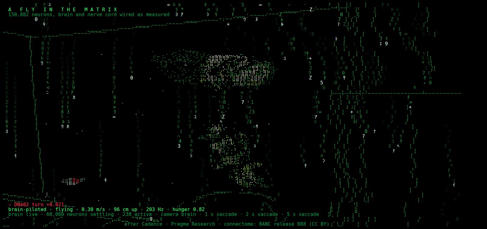
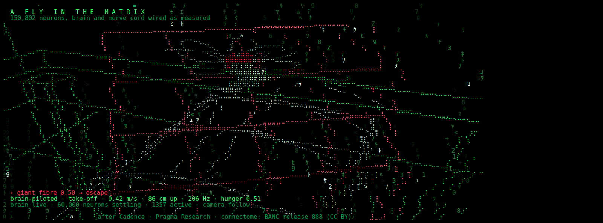
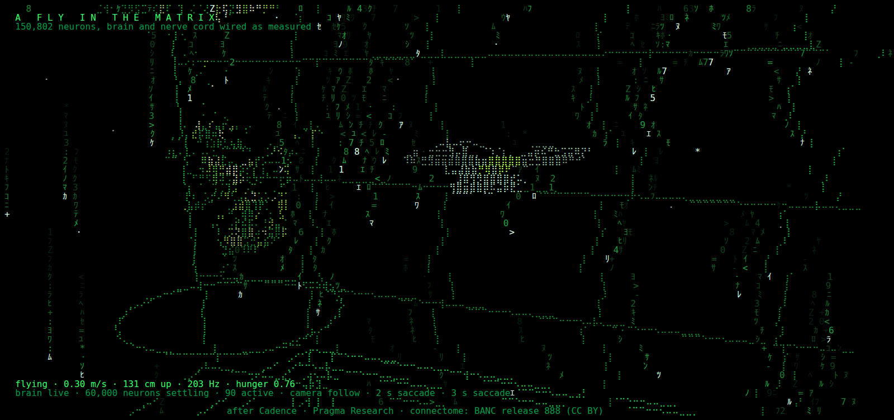
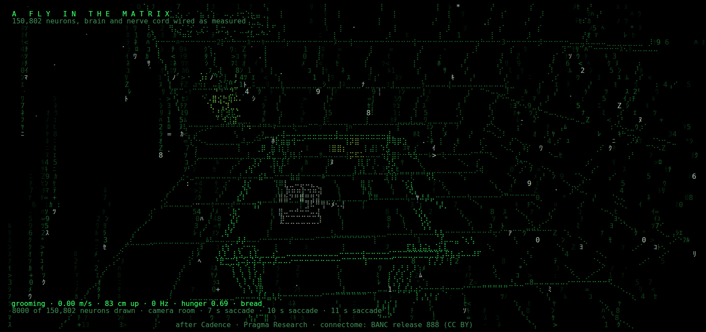
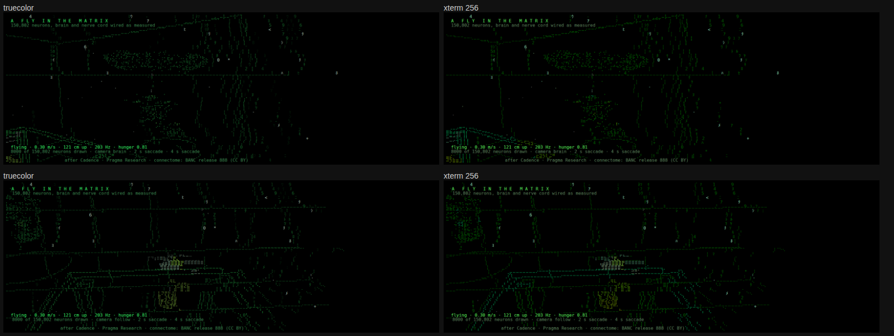

# flysaver: A fly in the Matrix, as an Omarchy screensaver

A terminal screensaver for [Omarchy](https://omarchy.org). It's a take on
Pragma Research's [A fly in the Matrix](https://floatingpragma.io/cadence-examples/fly-matrix/)
drawn in truecolor text and braille. The scene has four parts:

- Matrix digital rain
- a green wireframe room with a table, a banana and a piece of bread
- a wireframe fruit fly that flies bouts, makes saccades, lands, grooms and feeds
- the fly's real nervous system as a turning hologram, **running live**. The
  60,000-neuron BANC sub-net that the original simulates, with 1.2 million
  synapse classes wired as measured, runs the Cadence rate model every frame.
  The fly's senses feed its sensory neurons, and every active neuron lights up
  where it sits. Numerically, it matches the Cadence library to 3e-16.
- **the brain flies the fly.** Its real output neurons steer: DNa02 turns
  it, the giant fibre fires it out of the way of a swatter, and over a fruit
  the mushroom body decides whether to land or leave
- **it learns, and remembers.** Sugar sits on one fruit. Each decision
  over a fruit is a lesson, and the library's actor-critic rewires the
  Kenyon-cell → MBON synapses (the fly's olfactory memory). The memory is
  saved between idle sessions, so the fly on your screen gets its own
  history
- a red-eyed mutant: in the Matrix, green is normal






It uses the same windows, launcher and exit behaviour as the stock screensaver:

- any key or mouse movement exits
- switching focus away exits
- every monitor closes together
- the idle → lock timing is untouched

It follows your current Omarchy theme.

## Install

A single command fetches the source from GitHub, builds it, installs it and
checks the setup:

```bash
curl -fsSL https://raw.githubusercontent.com/smkalle/vibe1/main/flysaver/deploy.sh | bash
```

If `git`, `rust`, `socat` or `jq` are missing, it asks before installing them
with pacman. It keeps its checkout in `~/.local/src/flysaver`. Re-run the same
command to update.

Options go after `bash -s --`:

| Option | Effect |
|---|---|
| `--now` | start the screensaver on every monitor right away |
| `--test` | run the test suite first |
| `--ref <branch/tag/sha>` | build a different version |
| `--uninstall` | remove flysaver |

For example: `curl -fsSL …/deploy.sh | bash -s -- --now`.

To build from a checkout by hand instead:

```bash
cd flysaver
cargo build --release
target/release/flysaver install
```

Then log out and back in. To try it right away:

```bash
flysaver launch     # every monitor, now
flysaver preview    # in this terminal
flysaver doctor     # check the setup
```

`install` touches nothing outside `$HOME` and needs no root:

| File | Purpose |
|---|---|
| `~/.local/bin/flysaver` | the binary: about 5 MB, static apart from libc, with the brain and connectome embedded |
| `~/.local/share/flysaver/bin/omarchy-screensaver` | a shim that runs flysaver, or falls back to the stock screensaver |
| `~/.config/uwsm/env.d/99-flysaver` | puts the shim first on the Hyprland session's `PATH` |
| `~/.local/share/flysaver/flysaver-launch` | `flysaver launch`: Omarchy's launcher, pointed at flysaver |
| `~/.config/omarchy/screensaver/run` | ready for the [proposed upstream hook](upstream/omarchy-screensaver-user-hook.patch) |
| `~/.config/omarchy/flysaver.toml` | settings (kept by `uninstall`) |

Why a PATH shim: Omarchy runs its screensaver as `omarchy-screensaver` in a
terminal. It has no setting for swapping that program, and the stock script
is owned by the `omarchy` package. Putting a shim first on the session `PATH`
through `~/.config/uwsm/env.d/` changes no Omarchy file, and `omarchy update`
can't undo it. That directory is where Omarchy's own uwsm env tells users to
put overrides. `upstream/` has a small patch that would make this a
first-class hook.

- **Turn it off, keep it installed:** `touch ~/.config/omarchy/flysaver.disabled`
  (the shim then runs the stock screensaver).
- **Remove it:** `flysaver uninstall`, then log out and back in.

## Settings

`~/.config/omarchy/flysaver.toml`. Every key is optional; see
[flysaver.example.toml](flysaver.example.toml).

| Key | Default | |
|---|---|---|
| `fps` | `30` | 5–60 |
| `battery_fps` | `20` | used while any battery is discharging |
| `rain_density` | `0.45` | share of columns raining |
| `rain_glyphs` | `"katakana"` | or `"ascii"` if your fonts lack half-width katakana |
| `layers` | `["rain","room","brain","fly","hud"]` | add `"logo"` to show your `screensaver.txt` with the rain parting around it |
| `brain_points` | `8000` | 500–20000 neurons |
| `camera` | `"cycle"` | `follow`, `room`, `brain`, or `cycle` through them every 30–60 s |
| `palette` | `"theme"` | the current Omarchy theme; themes whose accent is grey (vantablack, white, solitude) get the original's `#39ff6a` instead. `"theme-strict"` follows even a grey theme; `"matrix"` always uses the green |
| `colors` | `"auto"` | `"truecolor"`, `"256"`, or `auto`: truecolor when `COLORTERM` is `truecolor`/`24bit`, else 256 |
| `brain` | `"live"` | the real rate model, or `"decorative"` for the lighter region pulses (about 2% of a core instead of about 6.5%) |
| `brain_steps` | `1` | model steps per frame, 1–4 |
| `vivid` | `true` | stronger, brighter colour: OKLab chroma ×1.8 with a lightness floor, and higher brightness floors. `false` restores the flatter look |
| `pilot` | `"brain"` | the live brain's output neurons steer, or `"instincts"` for the procedural layer alone (the original's control condition). `brain` needs `brain = "live"` |
| `threats` | `true` | a swatter comes for a sitting fly every 40–90 s |
| `eyes` | `"red"` | the red-eyed mutant, or `"theme"` for the theme's firing colour |
| `learning` | `true` | lessons change the Kenyon-cell → MBON synapses; `false` keeps the measured seam fixed |
| `remember` | `true` | load and save the fly's memory in `~/.local/state/flysaver/memory.bin` |
| `sugar_minutes` | `20` | minutes of screensaver time before the sugar moves to the other fruit (5–240) |
| `bitter` | `true` | the sugar is sometimes laced with caffeine, which the fly tastes and learns from; `false` keeps it always sweet |
| `glitch` | `true` | the occasional stutter and jitter |
| `hud` | `true` | title, status line, credits |

The same options work as flags: `flysaver preview --camera brain --palette matrix`.

### 256 colours

`colors = "256"` limits the screensaver to the xterm 256-colour palette. That
helps inside tmux or screen without truecolor passthrough, or on terminals
that lack 24-bit colour, and it also cuts output by about a third.

- **Which colours it uses:** only the 6×6×6 colour cube and the grey ramp
  (indices 16–255). Indices 0–15 are skipped, because terminals and Omarchy
  themes redefine them.
- **How it matches colours:** it compares hue in OKLab, a perceptual colour
  space. Dim greens stay dark green instead of turning grey. A colour too dim
  for the darkest matching shade fades to black instead of jumping brighter.
- **What you lose:** there are about 4–6 visible brightness steps per colour
  instead of 8, so depth fading is coarser.



## The live brain

The brain is the sub-net that *A fly in the Matrix* settles: 60,000 of the
150,802 BANC neurons, recruited from the flight, looming, odour, taste and
mushroom-body populations.

- **The model:** every frame, flysaver runs one step of the Cadence graded rate
  model on it (`src/neuro.rs`).
- **Exactness:** the weights are rebuilt from the synapse counts, signs and
  cell-class gains exactly as the library composes them. They match the
  original's f64 weights bit for bit, which `flysaver doctor` checks.
- **Parity:** the step reproduces `cadence.Brain`'s own recorded outputs
  (`tests/parity_cases.txt`) to 3e-16.

**The senses** (`src/senses.rs`) feed it the way the original page does:

| Neurons | Driven by |
|---|---|
| Halteres | a flight tone while flying |
| Ocelli | the sky, from the body's orientation |
| HS/VS optic-flow cells | turning (saccades drive them hard) |
| Antennae | airspeed |
| Odour receptors | a plume from the banana and the bread |
| Sugar taste | feeding |
| Leg touch | standing |
| Dopamine | reward |

This room has no swatting hand, so the looming detectors see the landing
surface grow during the final approach.

**What you can see** in the model (not scripted):
- A saccade reaches the wing steering motor neurons.
- A smell travels receptors → projection neurons → a sparse Kenyon-cell code
  → the mushroom body's memory output neurons.

Both are tested (`src/senses.rs`, `through_the_wiring`).

## The brain flies the fly

The instinct layer is the procedural behaviour: flight bouts, saccades,
wall avoidance and sits. In the original it's the control condition and the
fallback. The **brain layer** reads the live model's output neurons as
deviations from their level-flight rest and overrides the instincts, with
the original's rules and constants (`web/life.js`):

| Neurons | What they do | Under our senses |
|---|---|---|
| DNa02 left − right | turn the fly (6 rad/s per unit) | a turn drives them against itself: an optomotor stabilising reflex, from the wiring |
| giant fibre > 0.5 | **escape**: jump off, away from the threat | a swatter coming at a sitting fly fires it when the swatter is about 10 cm away. The fly gets out every time in the tests, while on instincts it gets hit every time |
| MBON11 vs MBON05 | over a fruit, approach or avoid (softmax, T 0.3) | the naive fly prefers the bread (p ≈ 0.70) to the banana (p ≈ 0.35) |
| DNp07/DNp10 > 0.15 | land now | rises with strong looming |
| MN9 | feeding | silent in flight; bursts when the fly lands on sugar (see [It tastes](#it-tastes)) |
| DNp09, aDN | speed, grooming | stay silent under these senses, so the instincts carry those behaviours |

**The swatter.** A wireframe swatter comes for a sitting fly every 40–90 s.
It looms the way the original's swatting hand does. If the giant fibre fires
first, the fly escapes. If not, it's struck: it tumbles, and the punishment
dopamine (PPL1) lights up. The HUD shows the brain's latest decision in the
eye colour, for example `› giant fibre 0.537 → escape` or
`› mushroom body: bread, approach (p 0.70)`.

## It learns, and remembers

This is the original's lesson loop (`web/life.js`, `web/learner.js`). A
hungry fly hovers over a fruit for a second until its brain has settled
into the smell, and then the mushroom body decides: approach or avoid.
That decision is a **lesson**, and its outcome teaches the brain:

| Outcome | Reward |
|---|---|
| lands on the sugared fruit (and feeds) | +1 |
| leaves an empty fruit, or avoided one | 0 |
| the swatter strikes it while it sits there | −1 |

**The rule.** The library's actor-critic (`src/learner.rs`, ported from
`web/learner.js` with the page's settings):
- Two nudged settles at the decision give every Kenyon-cell → MBON synapse
  an eligibility trace.
- The dopamine is the temporal-difference error.
- Each of the 16,795 synapses moves by η × dopamine × trace.

**Sugar.** It sits on one fruit, marked with a twinkle, and moves after
`sugar_minutes` of screensaver time, so the fly has to relearn.

**Memory.** The learned synapses, the critic, where the sugar is and the
lesson counts are saved to `~/.local/state/flysaver/memory.bin`:
- after every lesson and on exit
- loaded at the start of every idle session
- refused if it was made for a different brain
- erased with `flysaver forget`
- reported by `flysaver doctor`

With several monitors, each runs its own fly, and the last one to save wins.

**Check it without waiting for idle:**

```bash
flysaver train --minutes 15          # headless, logs every decision and lesson
flysaver train --minutes 60 --save   # the same, with your saved memory
```

Here's a real run (seed 3, 15 minutes, sugar on the bread):

```
  14.8s  mushroom body: bread, approach (p 0.34)
  16.6s  lesson: bread, sugar +1 (dopamine +1.00)
  45.4s  mushroom body: banana, approach (p 0.36)
  49.5s  lesson: banana, struck there -1 (dopamine -1.00)
  73.8s  mushroom body: bread, approach (p 0.35)
  77.2s  lesson: bread, sugar +1 (dopamine +0.99)
  98.4s  mushroom body: bread, approach (p 0.55)
  ...
done in 38 s: 37 lessons (14 sugar, 1 blows), 9747 of the 16,795 synapses changed; sugar on the bread
approach p, banana  first 3 decisions 0.36  ->  last 3 0.38   (15 decisions)
approach p, bread   first 3 decisions 0.45  ->  last 3 0.80   (22 decisions)
```

**The eyes.** They're red. In real *Drosophila*, red eyes are the wild type,
and Morgan's famous 1910 mutant was the *white*-eyed one. But in the Matrix
green is normal, so this fly is the mutant. `eyes = "theme"` restores the
old look.

## It tastes

Feeding is the brain's decision, through the classic gustatory assay: the
**proboscis extension reflex**. When the fly lands on the sugared fruit, its
labellum tastes the sugar and the proboscis motor neuron **MN9** fires,
peaking about 1.3 s after touchdown. The proboscis extends as far as MN9
drives it. If the peak passes the feeding level, the fly feeds.

**Bitter.** Each time the sugar is placed or moves, it's laced with
caffeine 40% of the time, at a random strength from 0.2 to 1. The HUD shows
it (`sugar on the bread (caffeine 0.60)`). Bitter taste on the labellum and
front legs suppresses MN9 through the measured wiring. These are the
model's own numbers, the peak MN9 after landing:

| Caffeine | none (no sugar) | 0 | 0.25 | 0.5 | 0.75 | 1 |
|---|---|---|---|---|---|---|
| bread, a brain's first taste | 0 | 0.476 | 0.475 | 0.442 | 0.229 | 0.013 |
| bread, an experienced fly | 0 | 0.116 | 0.109 | 0.029 | 0.004 | 0.000 |
| banana, an experienced fly | 0 | 0.199 | 0.194 | 0.091 | 0.021 | 0.002 |

The first sugar a freshly loaded brain tastes bursts about ten times higher
than any taste after it. That's why the original's feeding level of 0.2
would let an experienced fly starve. Instead the feeding level is set
against the silent baseline, at **0.005**. In 152 landings on plain sugar
across six 30-minute runs, the weakest peak was 0.016.

**Known limit.** The first sugar of each idle session is taken even when
strongly laced, because that naive burst survives bitter 1.0 at 0.013.

In four 45-minute runs with lacing on:

| Caffeine | fed | refused |
|---|---|---|
| none | 94 | 0 |
| 0.34–0.40 | 19 | 0 |
| 0.86–0.89 | 1 (a first taste) | 30 |

**A bitter lesson.** Bitter drives the PPL1 punishment dopamine neurons, and
the lesson on the sugared fruit pays (fed ? 1 : 0) − caffeine:

```
lesson: bread, sugar, MN9 peak 0.044 → fed +1 (dopamine +0.93)
lesson: bread, sugar + caffeine 0.34, MN9 peak 0.021 → fed +0.66 (dopamine +0.50)
lesson: bread, sugar + caffeine 0.86, MN9 peak 0.001 → refused -0.86 (dopamine -0.86)
```

Ten lessons on a banana laced at 1.0 drop its approach probability from 0.35
to 0.20. In a full run, a fly whose bread was laced at 0.86 went from
approaching the bread at p 0.58 to 0.26, and turned to the unlaced banana.

**Its colour.** The proboscis has its own colour: **amber-gold `#ffb020`**
for sugar, going through peach and pale lilac to **violet `#a070ff`** as the
caffeine rises. The mix is in OKLab, because an RGB mix passes through the
eyes' dusty red. Amber sits 53° of OKLab hue from the red eyes (`#ff3048`)
and 79° from the Matrix-green body, and the violet end sits 86° from the
eyes. A test holds
every shade along the way off the eyes' red.

`flysaver snapshot --taste 0.6 --time 1.6 --camera follow` shows a fly
feeding on sugar laced at 0.6.

## Performance

These numbers come from `flysaver bench --size 230x65`, which is about a
2560×1440 screen at Omarchy's screensaver font size.

| | live brain (default) | decorative brain |
|---|---|---|
| CPU per frame | 2.1–2.2 ms (6.3–6.6% of one core at 30 fps) | 0.6–0.65 ms (1.8–2.0%) |
| Output to the terminal (truecolor) | 0.48–0.58 MB/s | 0.42–0.61 MB/s |
| Peak memory | 56.2 MB | smaller (the brain isn't loaded) |
| A mushroom-body decision (learning) | about 29 ms, once per lesson (every 20–30 s) | not run |
| Start to first frame | about 110 ms (load, then 40 warm-up steps) | faster |
| Exit | under 2 ms after a key or mouse movement; about 45 ms after focus leaves | same |

**Why a step is fast:** a model step costs about 1.1–1.6 ms. The sums are
pushed from active neurons only. Silent neurons are exactly zero, and senders
are visited in the same order the library adds them, so the result is
bit-identical to summing over all 1.2 million synapse classes.

**Other costs:** only changed cells are written, in one synchronized update
per frame. 256-colour mode writes about a third less, for a little more CPU.

## How it works

| File | Role |
|---|---|
| `src/learner.rs` | The mushroom body's actor-critic, ported from the original's `web/learner.js`. `tests/learner_cases.txt` (recorded by `tools/record_learner.mjs` from the original) holds it to 7.6e-17. |
| `src/memory.rs` | The fly's memory file: learned synapses, critic, sugar and counters. |
| `src/sim.rs` (instinct layer) | The fly's procedural life: fly, approach a smell, land, sit, groom, feed, take off. Rates follow the original's ethogram (about 0.45 saccades per second of flight, 5–15 s bouts). Also the camera director. |
| `src/neuro.rs` | The Cadence rate model on the 60,000-neuron sub-net, ported from the original's `web/brain.js`. |
| `src/senses.rs` | The fly's state mapped onto its afferents, ported from the original's `web/senses.js` and `web/life.js`, including the swatter's looming. |
| `src/sim.rs` | The instinct layer, the brain layer's `Command` (turn, speed, land, escape, feed, groom), the mushroom body's decision, and the swatter. |
| `src/scene/` | One module per layer. `brain.rs` draws the whole-brain silhouette and, in live mode, every active neuron on a heat ramp. In decorative mode it pulses regions instead. |
| `src/raster.rs`, `src/fb.rs` | Perspective projection and lines drawn into braille dots (2×4 per cell). The layers are composed into cells and written to the terminal as a diff. |
| `src/term.rs`, `src/hypr.rs` | Raw mode, mouse-motion reporting, signals, Hyprland pointer and focus handling, and the close-every-monitor exit. |
| `tools/build_brain.py` | Builds `assets/brain.bin` (4.2 MB) from the original's `brain.json` and `atlas.json`: delta-varint senders, counts and 2-bit signs, and it checks that every weight rebuilds exactly. |
| `tools/build_connectome.py` | Builds `assets/connectome.bin` (140 KB), the silhouette sample. |
| `tools/convert_parity.py` | Turns the library's `parity_cases.json` into `tests/parity_cases.txt`. |

`flysaver about` spells out what is simulated and what is supplied.

## Tests

```bash
cargo test --release                       # unit tests, golden frames, parity with the Cadence library
python3 tests/pty_lifecycle.py             # exits and terminal restore in a real pty
python3 tests/hypr_contract.py             # focus-loss exit, pointer, close-all, against a fake Hyprland
tests/install_roundtrip.sh                 # install, shim, fallback, uninstall in a scratch $HOME
NODE_PATH=$(npm root -g) node tools/shoot.cjs out.png < <(flysaver snapshot --html --camera brain)
```

After an intentional visual change, regenerate the golden frames with
`tests/golden/regen.sh`.

## Credits

- After *A fly in the Matrix* by Bernhard Mueller / Pragma Research, a
  [Cadence](https://floatingpragma.io/cadence/) example. The source is
  [github.com/Jarikononen/cadence-examples](https://github.com/Jarikononen/cadence-examples)
  under the MIT licence
  ([notice](NOTICE-cadence-examples.txt)). `src/neuro.rs` and `src/senses.rs`
  are ports of its `web/brain.js`, `web/senses.js` and `web/life.js`,
  `src/learner.rs` of its `web/learner.js`, and
  `tests/parity_cases.txt` is its `tests/parity_cases.json`. The scene, the
  palette and the behaviour rates follow it.
- The neurons, their positions and their wiring come from BANC release 888
  (adult female *Drosophila* brain and nerve cord), by the Lee lab and the
  BANC community, CC BY 4.0. They were taken from the atlas and sub-net that
  ship with the example above.
- The launcher script follows Omarchy's `omarchy-launch-screensaver`
  (Omarchy, MIT).
